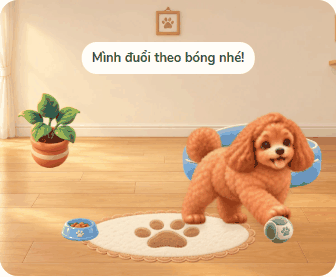
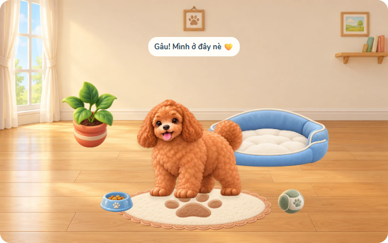
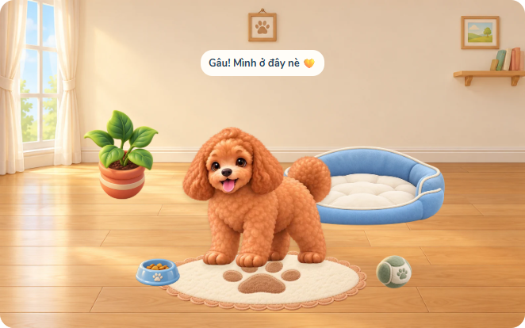
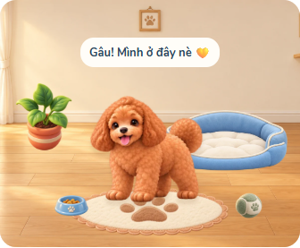

# Phản hồi Thỏ — đi mượt, mặt trưởng thành và phòng thoáng

Nhánh pet-smooth-growth, chờ Nam xem và Claude review trước merge. Không thay KIND/id, hồ sơ, giá, quyền sở hữu, luật tăng trưởng hoặc Storage/Cloud/Quiz.

## Chuyển động

Render từng thao tác trước đây tạo actor mới ở giữa phòng. Nay chụp vị trí chân đang hiển thị trước render và dựng lại tại vị trí đó; flush trạng thái đầu trước CSS transition. Cún đi với thời gian theo quãng đường (350–1200ms), quay hướng khi đi trái/phải, tới nơi mới ăn/ngủ/chơi; đường về cũng dùng tư thế đi. Idle không vừa trượt vừa ngủ. Click phản ứng dừng bước đi tại vị trí hiện tại. Depth theo chân đang hiển thị.

Stop/ẩn tab đóng băng cả CSS transition, huỷ RAF/timer. Giảm chuyển động được tôn trọng, không lưu runtime position vào hồ sơ.

GIF là bản xem nhanh từ screenshot của web, không phải phép đo FPS. Mã test kiểm tra vị trí trung gian, render không reset về spawn, đi tới bát rồi mới ăn, dừng thật và reduced motion.

## Trưởng thành

Chỉnh riêng atlas trưởng thành bằng một lượt built-in imagegen, tăng tỷ lệ đầu/mặt; giữ hai giai đoạn nhỏ và ảnh cũ. Prompt/source ở pet-adult-v3-prompt.json. WebP v3 1254×1254, 451824 byte, alpha giữ nguyên; PNG gốc ở output/pet-art/masters-v3.

Khung mới đã rà lại neo nơ. js/pet-adult-art-v3.js có 16 silhouette SVG, sinh bởi tools/adult_sprite_clips.py từ alpha nguồn để không vẽ phần sprite bên cạnh; không sửa pixel PNG. Bảng 48 khung có nơ ở pet-bow-anchors.png. Neck/back vẫn metadata dự phòng, chưa bán áo/vòng cổ.

Trước (cùng khung phòng mới để so tỷ lệ):

Sau:

## Phòng

Mobile mở vùng x120–880 (760 đơn vị), walkArea chân x290–710; đồ vẫn trong vùng an toàn cũ, cún có thêm khoảng đi. Desktop max-width1180, panel230px; giảm nhẹ thảm/cây/bát/bóng để thoáng thêm, giữ giường đủ chứa cún.

Chưa có nhà tắm, bồn tắm hay vòi sen. Các phòng/tương tác đó thuộc đợt sau.

## Kiểm tra

42 unit pet/room/challenge/accessory. Browser motion, art, accessory, room, pet flow và mobile payload; main atlas trưởng thành v3 chỉ tải khi ở giai đoạn2. Xem lại tư thế/nơ/sleep trên ảnh trước merge.
