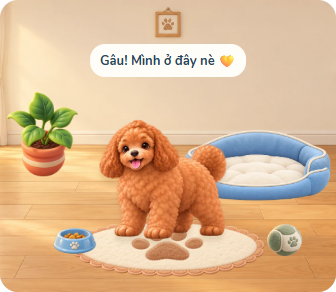
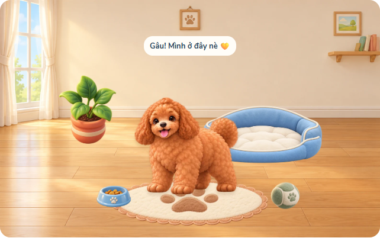
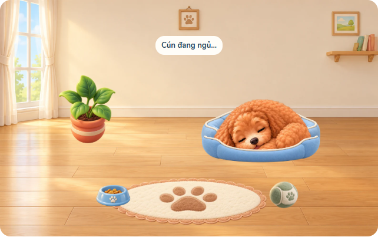

# Phòng cún mẫu v1 — chờ Nam duyệt

Một phòng tường kem, sàn gỗ, cửa sổ bên trái; tranh/kệ ở mép phải chỉ thuộc nền. Năm món cơ bản: giường xanh với hai lớp, thảm kem dấu chân, bát xanh, bóng vải xanh nhạt và chậu cây đất nung. Bộ hình tạo bằng built-in image_gen, prompt đầy đủ ở pet-room-art-prompts-v1.json.

## Phân phối và dữ liệu

Hình dùng thật trên web ở assets/pet/room: nền ≤1600px, sáu lớp đồ ≤512px. Tổng 225394 byte (nền và năm món; giường hai ảnh). WebP giữ chính xác alpha sau resize; bed/front giữ cùng canvas 512×287 để khớp nhau. PNG gốc giữ nguyên ở output/pet-room/masters-v1 ngoài checkout. tools/convert_room_webp.py chỉ resize/encode, không vẽ lại hoặc tách hình. Nguồn từng ảnh ghi trong pet-room-art-sources-v1.json.

Chỉ đồ mặc định có hình mới trong đợt mẫu. Đồ trả sao xanh/hồng giữ minh hoạ cũ, chờ đợt biến thể sau duyệt. Màu tường đã mua vẫn phủ màu lên vùng tường; sàn và đồ không bị đổi màu. Không đổi id, giá, hồ sơ, phụ kiện hoặc luật chơi.

Desktop walkArea chân x160–850, bị chặn thêm theo hộp cún từng giai đoạn; mobile giữ x310–690. Resize chỉ đổi viewport/vùng đi, không ghi dữ liệu hoặc chào lại.

## Kiểm tra

Room unit kiểm tra tách vùng đi và tương thích dữ liệu cũ. Browser kiểm tra 360/390/430/1280px, bảy ảnh phòng tải thành công, ngủ trong giường hai lớp, và chỉ tải atlas giai đoạn hiện tại. Ảnh trên lấy từ trình duyệt chạy web thật qua route local; hồ sơ thử riêng, không ghi dữ liệu lên máy chủ.

PR này chờ Nam duyệt hình và Claude review trước merge. Chưa làm biến thể màu hay nơ trong shop.
