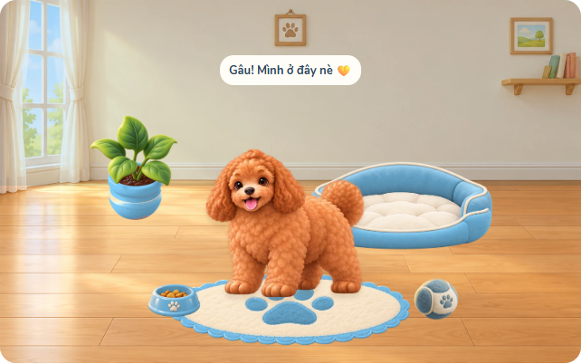
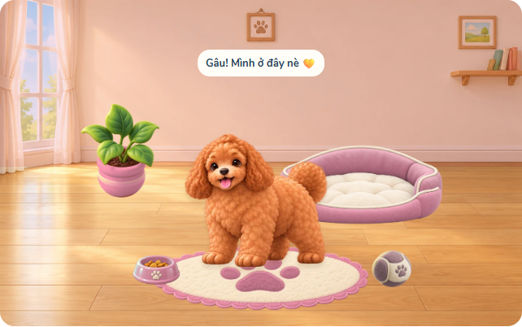

# Phòng cún mẫu v1 — chờ Nam duyệt

Một phòng tường kem, sàn gỗ, cửa sổ bên trái; tranh/kệ ở mép phải chỉ thuộc nền. Năm món cơ bản: giường xanh với hai lớp, thảm kem dấu chân, bát xanh, bóng vải xanh nhạt và chậu cây đất nung. Bộ hình tạo bằng built-in image_gen, prompt đầy đủ ở pet-room-art-prompts-v1.json.

## Phân phối và dữ liệu

Hình dùng thật trên web ở assets/pet/room: nền ≤1600px, sáu lớp đồ ≤512px. Tổng 225394 byte (nền và năm món; giường hai ảnh). WebP giữ chính xác alpha sau resize; bed/front giữ cùng canvas 512×287 để khớp nhau. PNG gốc giữ nguyên ở output/pet-room/masters-v1 ngoài checkout. tools/convert_room_webp.py chỉ resize/encode, không vẽ lại hoặc tách hình. Nguồn từng ảnh ghi trong pet-room-art-sources-v1.json.

Đồ mặc định và toàn bộ đồ trả sao xanh/hồng đều có hình WebP. Biến thể được recolor xác định từ PNG mặc định đã duyệt bằng tools/recolor_pet_room.py, không gọi imagegen thêm. Chỉ vùng vật liệu có màu đổi hue/saturation; phần kem, thức ăn và lá cây giữ nguyên. Độ sáng HSV value trước encode và alpha sau encode được kiểm tra giữ chính xác. Hai lớp giường giữ cùng canvas. Màu tường đã mua vẫn phủ màu lên vùng tường; sàn và đồ không bị đổi màu. Không đổi id, giá, hồ sơ, phụ kiện hoặc luật chơi.

Desktop walkArea chân x160–850, bị chặn thêm theo hộp cún từng giai đoạn; mobile giữ x310–690. Resize chỉ đổi viewport/vùng đi, không ghi dữ liệu hoặc chào lại.

## Kiểm tra

Room unit kiểm tra tách vùng đi và tương thích dữ liệu cũ. Browser kiểm tra 360/390/430/1280px, bảy ảnh phòng tải thành công, ngủ trong giường hai lớp, và chỉ tải atlas giai đoạn hiện tại. Ảnh trên lấy từ trình duyệt chạy web thật qua route local; hồ sơ thử riêng, không ghi dữ liệu lên máy chủ.

PR này chờ Nam duyệt hình và Claude review trước merge. Biến thể xanh/hồng đã bổ sung trong cùng PR; chưa làm nơ trong shop.

## Review bổ sung — đồ trả sao

Test kiểm tra mọi item trả sao có img, bed có frontImg; wall dùng asset nền và lớp phủ màu. Luồng browser mua thật từng món, kiểm tra ảnh tải được và không dùng SVG/emoji/CSS placeholder, ở cả 1280px và 390px. Chỉ món đang đặt được vẽ; không tải trước toàn bộ bộ màu. Giữ nguyên giá 50 sao và id đang bán trên main.
