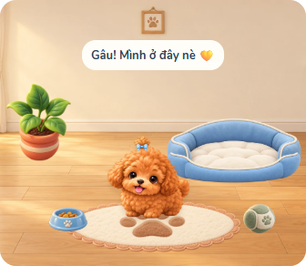
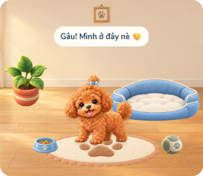
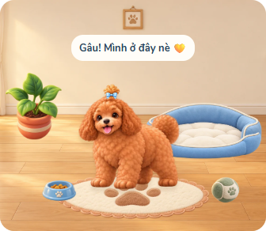

# Phụ kiện cún v1 — chờ review

Một món: nơ xanh đã có, 50 sao như đồ trang trí. Mua một lần tự đeo, tháo/đeo lại miễn phí ở đầu panel Trang trí. Dùng cùng ảnh WebP cho ba giai đoạn, thay scale và vị trí neo; không imagegen thêm. Khi ngủ tạm ẩn nơ theo pose, quyền sở hữu và trạng thái đeo vẫn giữ nguyên.

## Dữ liệu và giao dịch

`profile.petWardrobe = {v:1, owned:[id], equipped:{head,neck,back}}`. Tách khỏi pet vì mã pet v1 dựng lại pet từ các trường cũ; nếu lưu phụ kiện trong pet thì tab cũ chăm cún sẽ bỏ mất trường mới. Trường profile riêng vẫn đi cùng snapshot/file sao lưu. Đã thử chính fixture pet-flat-v1 cho ăn sau mua nơ và kiểm tra wardrobe không mất.

Mua/đeo/tháo đều qua Pet.tx: load mới, ghi sao + wardrobe cùng một lần Storage.save, xác nhận lại cả wardrobe. Không giữ hồ sơ để mua. Duplicate receipt/owned chặn trừ đôi; khoá mua UI 600ms. Thiếu sao hoặc save lỗi không báo mua thành công. Không sửa Storage/Cloud/Quiz, KIND hoặc giá đồ cũ.

Id phụ kiện bền vững `bow-blue`. Id lạ, sai slot, món chưa sở hữu không được đeo. Dữ liệu cũ thiếu wardrobe đọc như tủ trống, không tự ghi khi render. Cún lớn vẫn dùng được nơ, không mua lại.

## Hình và neo

js/pet-accessories.js định nghĩa catalog và điểm neo head cho 3×16 khung atlas. Mỗi neo có x/y/angle/scale/visible/layer, trả theo canvas SVG chuẩn 360×360. Nơ không gắn vào ảnh cún; pose/walkB/wagB thay khung và điểm neo cùng lúc. Sleep visible=false. Lớp front/behind được renderer tôn trọng.

Neck/back có metadata dự phòng theo frame, chưa có món bán hoặc xác nhận khớp hình phụ kiện ở hai vị trí đó. Khi thêm áo/vòng cổ cần kiểm tra bộ ảnh riêng; không xem metadata dự phòng là đã duyệt hình.

Ảnh nơ hiện tại assets/pet/bow-blue-tuft-v1.webp (23.9KB) đã duyệt, không tạo ảnh mới. Room chỉ tải nơ khi đeo; panel Trang trí có thumbnail để xem trước. Không tải các atlas giai đoạn khác.

## Kiểm tra

8 test accessory: mua/duplicate/đeo/tháo/reload, lỗi lưu, id lạ, mã pet cũ, tăng trưởng và metadata. Browser: mua/bấm đúp/tháo/đeo, Cloud collect/apply, ba giai đoạn, 13 tư thế, 390px; bảng rà toàn bộ 48 khung ở tests/out/pet-bow-anchors.png. Các test pet/room/challenge và luồng art/mobile vẫn chạy chung.

Nhánh pet-accessory, chờ Claude review trước merge.
